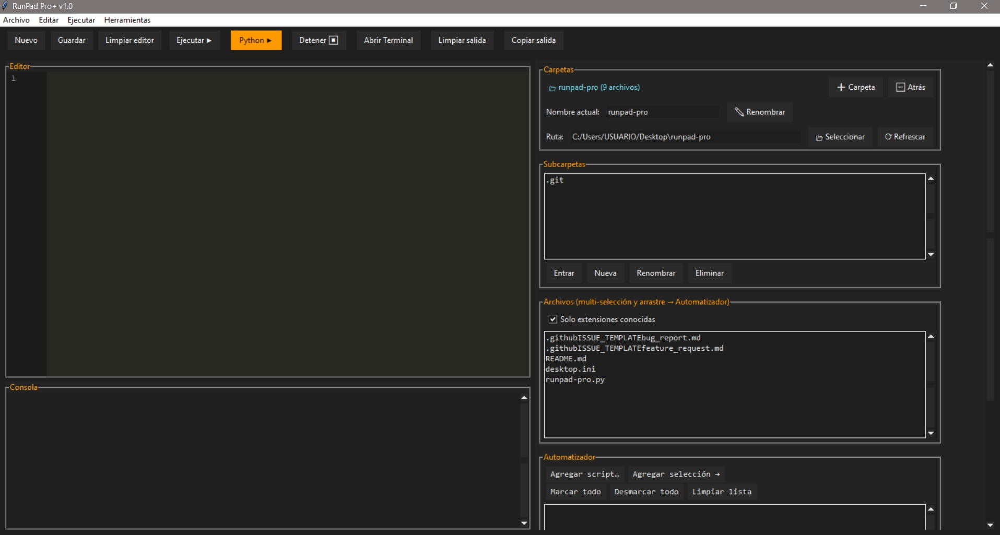

# RunPad Pro+ v1.0

Editor y lanzador de scripts en **Tkinter**. Un solo archivo (`runpad-pro.py`). Tema oscuro, consola integrada y “Automatizador” con arrastrar-y-soltar.

<p align="center">
  
</p>

## Autor
Kevin Madriz Brenes — Costa Rica.

## Características
- Editor con líneas, zoom y resaltado simple.
- Guardar / Guardar como.
- Buscar / Reemplazar.
- Consola integrada y cola de salida.
- Ejecutar archivo actual y lote de scripts marcados.
- Explorador de carpetas, subcarpetas y archivos.
- Arrastrar archivos → Automatizador.
- Abrir terminal en el directorio activo.
- Preferencias en `~/.runpad_pro_settings.json`.

## Requisitos
- Windows 10/11, Linux o macOS.
- Python 3.9+ con Tkinter.

## Uso
```bash
python runpad-pro.py
